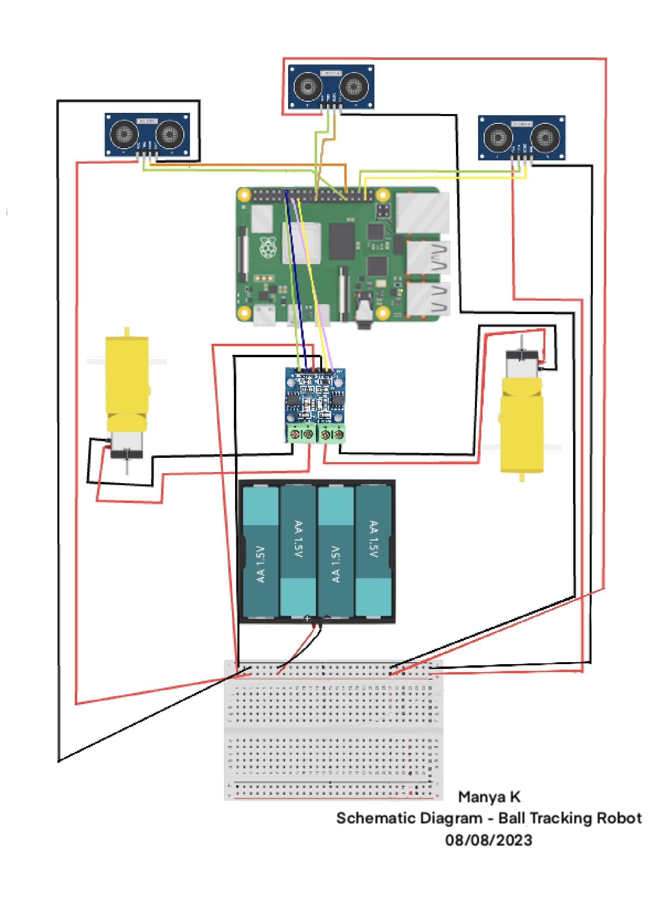

# Ball Tracking Robotic Car
My goal of this project was to create a robot car with camera to me drawn to a  colored ball and be able to follow it. From this, I learned how to use a raspberry pi, gotten a much better understanding of circuits, and Python. 

As I worked on this project, my raspberry pi would often heat up so my modifications were a program that displays the temprature of the pi in the top right of the display and an ice tower fan attached to my pi. 

```HTML 
<!--- This is an HTML comment in Markdown -->
<!--- Anything between these symbols will not render on the published site -->-
```

| **Engineer** | **School** | **Area of Interest** | **Grade** |
|:--:|:--:|:--:|:--:|
| Manya K | School Name | Electrical Engineering | Incoming Junior

**Replace the BlueStamp logo below with an image of yourself and your completed project. Follow the guide [here](https://tomcam.github.io/least-github-pages/adding-images-github-pages-site.html) if you need help.**


  
# Final Milestone

**Don't forget to replace the text below with the embedding for your milestone video. Go to Youtube, click Share -> Embed, and copy and paste the code to replace what's below.**

<iframe width="560" height="315" src="https://www.youtube.com/embed/F7M7imOVGug" title="YouTube video player" frameborder="0" allow="accelerometer; autoplay; clipboard-write; encrypted-media; gyroscope; picture-in-picture; web-share" allowfullscreen></iframe>

For your final milestone, explain the outcome of your project. Key details to include are:
- What you've accomplished since your previous milestone
- What your biggest challenges and triumphs were at BSE
- A summary of key topics you learned about
- What you hope to learn in the future after everything you've learned at BSE


# Second Milestone

**Don't forget to replace the text below with the embedding for your milestone video. Go to Youtube, click Share -> Embed, and copy and paste the code to replace what's below.**

<iframe width="560" height="315" src="https://www.youtube.com/embed/I1p58-inm4Y" title="YouTube video player" frameborder="0" allow="accelerometer; autoplay; clipboard-write; encrypted-media; gyroscope; picture-in-picture; web-share" allowfullscreen></iframe>

For your second milestone, explain what you've worked on since your previous milestone. You can highlight:
- Technical details of what you've accomplished and how they contribute to the final goal
- What has been surprising about the project so far
- Previous challenges you faced that you overcame
- What needs to be completed before your final milestone 

# First Milestone

<iframe width="560" height="315" src="https://www.youtube.com/embed/L9ebNFK4SKc" title="YouTube video player" frameborder="0" allow="accelerometer; autoplay; clipboard-write; encrypted-media; gyroscope; picture-in-picture; web-share" allowfullscreen></iframe>

For your first milestone, describe what your project is and how you plan to build it. You can include:
- An explanation about the different components of your project and how they will all integrate together
- Technical progress you've made so far
- Challenges you're facing and solving in your future milestones
- What your plan is to complete your project

# Schematics 



# Code
Here's where you'll put your code. The syntax below places it into a block of code. Follow the guide [here]([url](https://www.markdownguide.org/extended-syntax/)) to learn how to customize it to your project needs. 

```c++
# import the necessary packages
from picamera.array import PiRGBArray     #As there is a resolution problem in raspberry pi, will not be able to capture frames by VideoCapture
from picamera import PiCamera
import RPi.GPIO as GPIO
import time
import cv2

import numpy as np

#hardware work
GPIO.setmode(GPIO.BOARD)

GPIO_TRIGGER1 = 31      #Left ultrasonic sensor
GPIO_ECHO1 = 32

GPIO_TRIGGER2 = 22      #Front ultrasonic sensor
GPIO_ECHO2 = 21

GPIO_TRIGGER3 = 36      #Right ultrasonic sensor
GPIO_ECHO3 = 37

MOTOR1B=11  #Left Motor
MOTOR1E=12

MOTOR2B=13  #Right Motor
MOTOR2E=15

#LED_PIN=13  #If it finds the ball, then it will light up the led

# Set pins as output and input
GPIO.setup(GPIO_TRIGGER1,GPIO.OUT)  # Trigger
GPIO.setup(GPIO_ECHO1,GPIO.IN)      # Echo
GPIO.setup(GPIO_TRIGGER2,GPIO.OUT)  # Trigger
GPIO.setup(GPIO_ECHO2,GPIO.IN)
GPIO.setup(GPIO_TRIGGER3,GPIO.OUT)  # Trigger
GPIO.setup(GPIO_ECHO3,GPIO.IN)
#GPIO.setup(LED_PIN,GPIO.OUT)

# Set trigger to False (Low)
GPIO.output(GPIO_TRIGGER1, False)
GPIO.output(GPIO_TRIGGER2, False)
GPIO.output(GPIO_TRIGGER3, False)

# Allow module to settle
def sonar(GPIO_TRIGGER,GPIO_ECHO):
      start=0
      stop=0
      # Set pins as output and input
      GPIO.setup(GPIO_TRIGGER,GPIO.OUT)  # Trigger
      GPIO.setup(GPIO_ECHO,GPIO.IN)      # Echo
     
      # Set trigger to False (Low)
      GPIO.output(GPIO_TRIGGER, False)
     
      # Allow module to settle
      time.sleep(0.01)
           
      #while distance > 5:
      #Send 10us pulse to trigger
      GPIO.output(GPIO_TRIGGER, True)
      time.sleep(0.00001)
      GPIO.output(GPIO_TRIGGER, False)
      begin = time.time()
      while GPIO.input(GPIO_ECHO)==0 and time.time()<begin+0.05:
            start = time.time()
     
      while GPIO.input(GPIO_ECHO)==1 and time.time()<begin+0.1:
            stop = time.time()
     
      # Calculate pulse length
      elapsed = stop-start
      # Distance pulse travelled in that time is time
      # multiplied by the speed of sound (cm/s)
      distance = elapsed * 34000
     
      # That was the distance there and back so halve the value
      distance = distance / 2
     
      #print ("Distance : %.1f" % distance)
      # Reset GPIO settings
      return distance

GPIO.setup(MOTOR1B, GPIO.OUT)
GPIO.setup(MOTOR1E, GPIO.OUT)

GPIO.setup(MOTOR2B, GPIO.OUT)
GPIO.setup(MOTOR2E, GPIO.OUT)

def forward():
      GPIO.output(MOTOR1B, GPIO.HIGH)
      GPIO.output(MOTOR1E, GPIO.LOW)
      GPIO.output(MOTOR2B, GPIO.HIGH)
      GPIO.output(MOTOR2E, GPIO.LOW)
     
def reverse():
      GPIO.output(MOTOR1B, GPIO.LOW)
      GPIO.output(MOTOR1E, GPIO.HIGH)
      GPIO.output(MOTOR2B, GPIO.LOW)
      GPIO.output(MOTOR2E, GPIO.HIGH)
     
def rightturn():
      GPIO.output(MOTOR1B,GPIO.LOW)
      GPIO.output(MOTOR1E,GPIO.HIGH)
      GPIO.output(MOTOR2B,GPIO.HIGH)
      GPIO.output(MOTOR2E,GPIO.LOW)
     
def leftturn():
      GPIO.output(MOTOR1B,GPIO.HIGH)
      GPIO.output(MOTOR1E,GPIO.LOW)
      GPIO.output(MOTOR2B,GPIO.LOW)
      GPIO.output(MOTOR2E,GPIO.HIGH)

def stop():
      GPIO.output(MOTOR1E,GPIO.LOW)
      GPIO.output(MOTOR1B,GPIO.LOW)
      GPIO.output(MOTOR2E,GPIO.LOW)
      GPIO.output(MOTOR2B,GPIO.LOW)
```

Tracking green color and round shapes:

```c++     
#Image analysis work
def segment_colour(frame):    #returns only the red colors in the frame
    
    hsv_roi =  cv2.cvtColor(frame, cv2.COLOR_BGR2HSV)
    mask_1 = cv2.inRange(hsv_roi, np.array([54,71,43]), np.array([81,255,149]))
    ycr_roi=cv2.cvtColor(frame,cv2.COLOR_BGR2YCrCb)
    #mask_2=cv2.inRange(ycr_roi, np.array((0.,165.,0.)), np.array((255.,255.,255.)))

    mask = mask_1 #| mask_2
    kern_dilate = np.ones((8,8),np.uint8)
    kern_erode  = np.ones((3,3),np.uint8)
    mask= cv2.erode(mask,kern_erode)      #Eroding
    mask=cv2.dilate(mask,kern_dilate)     #Dilating
    #cv2.imshow('mask',mask)
    return mask
def segment_colour_goal(frame):    #returns only the red colors in the frame
    
    hsv_roi =  cv2.cvtColor(frame, cv2.COLOR_BGR2HSV)
    mask_1 = cv2.inRange(hsv_roi, np.array([160, 160,10]), np.array([190,255,255]))
    ycr_roi=cv2.cvtColor(frame,cv2.COLOR_BGR2YCrCb)
    mask_2=cv2.inRange(ycr_roi, np.array((0.,165.,0.)), np.array((255.,255.,255.)))

    mask = mask_1 | mask_2
    kern_dilate = np.ones((8,8),np.uint8)
    kern_erode  = np.ones((3,3),np.uint8)
    mask= cv2.erode(mask,kern_erode)      #Eroding
    mask=cv2.dilate(mask,kern_dilate)     #Dilating
    #cv2.imshow('mask',mask)
    return mask

def find_blob(blob): #returns the red colored circle
    largest_contour=0
    cont_index=0
    contours, hierarchy = cv2.findContours(blob, cv2.RETR_CCOMP, cv2.CHAIN_APPROX_SIMPLE)
    for idx, contour in enumerate(contours):
        area=cv2.contourArea(contour)
        if (area >largest_contour) :
            largest_contour=area
           
            cont_index=idx
            #if res>15 and res<18:
            #    cont_index=idx
                              
    r=(0,0,2,2)
    if len(contours) > 0:
        r = cv2.boundingRect(contours[cont_index])
       
    return r,largest_contour

def target_hist(frame):
    hsv_img=cv2.cvtColor(frame, cv2.COLOR_BGR2HSV)
   
    hist=cv2.calcHist([hsv_img],[0],None,[50],[0,255])
    return hist

#CAMERA CAPTURE
#initialize the camera and grab a reference to the raw camera capture
camera = PiCamera()
camera.resolution = (640, 480)
camera.framerate = 16
rawCapture = PiRGBArray(camera, size=(640, 480))
trackGoal = False
 
# allow the camera to warmup
time.sleep(0.001)
 
# capture frames from the camera
for image in camera.capture_continuous(rawCapture, format="bgr", use_video_port=True):
      #grab the raw NumPy array representing the image, then initialize the timestamp and occupied/unoccupied text
      frame = image.array
      frame=cv2.flip(frame,1)
      frame = cv2.rotate(frame, cv2.ROTATE_90_CLOCKWISE)
      frame = cv2.rotate(frame, cv2.ROTATE_90_CLOCKWISE)
      global centre_x
      global centre_y
      centre_x=0.
      centre_y=0.
      hsv1 = cv2.cvtColor(frame, cv2.COLOR_BGR2HSV)
      if (trackGoal==False):
            mask_green=segment_colour(frame)
            loct,area=find_blob(mask_green)
      else:
            mask_red = segment_colour_goal(frame)
            loct,area=find_blob(mask_red)
      #masking red/green the frame
      
      x,y,w,h=loct
      print (area)
      #distance coming from front ultrasonic sensor
      distanceC = sonar(GPIO_TRIGGER2,GPIO_ECHO2)
      #distance coming from right ultrasonic sensor
      distanceR = sonar(GPIO_TRIGGER3,GPIO_ECHO3)
      #distance coming from left ultrasonic sensor
      distanceL = sonar(GPIO_TRIGGER1,GPIO_ECHO1)
             
      if (w*h) < 20:
            found=0
      else:
            found=1
            simg2 = cv2.rectangle(frame, (x,y), (x+w,y+h), 255,2)
            centre_x=x+((w)/2)
            centre_y=y+((h)/2)
            cv2.circle(frame,(int(centre_x),int(centre_y)),3,(0,110,255),-1)
            centre_x-=390
            centre_y-=280
            #print (centre_x,centre_y)
      initial=800
      flag=0
      #GPIO.output(LED_PIN,GPIO.LOW)
      
      
      
      cv2.imshow("draw",frame)    
      rawCapture.truncate(0)  # clear the stream in preparation for the next frame
         
      if(cv2.waitKey(1) & 0xff == ord('q')):
            break
      
      if(found==0):
            #if the ball is not found and the last time it sees ball in which direction, it will start to rotate in that direction
            if flag==0:
                  stop()
                  rightturn()
                  time.sleep(0.1)
            else:
                  stop()
                  leftturn()
                  time.sleep(0.1)
            stop()
            time.sleep(0.02)
      elif (found==1):
            if (trackGoal==False):
                  if (distanceC >= 8):
                        if (centre_x<=-30 or centre_x>=30):
                              stop()
                              if (centre_x<0):
                                    flag = 0
                                    leftturn()
                                    time.sleep(0.025)
                                    stop()
                                    continue
                              elif (centre_x>0):
                                    flag=1
                                    rightturn()
                                    time.sleep(0.025)
                                    stop()
                                    continue
                                    forward()
                            
                                    
                                    
                        else:
                              reverse()
                              time.sleep(0.1)
                              stop()
                  elif(distanceC<8):
                        stop()
                        trackGoal = True
            elif (trackGoal==True):
                  if (area < 130000):
                        if (centre_x<=-20 or centre_x>=20):
                              stop()
                              if (centre_x<0):
                                    flag = 0
                                    leftturn()
                                    time.sleep(0.025)
                                    stop()
                                    continue
                              elif (centre_x>0):
                                    flag=1
                                    rightturn()
                                    time.sleep(0.025)
                                    stop()
                                    continue
                        else:
                              forward()
                              time.sleep(0.1)
                              stop()
                  elif (area >= 130000):
                        stop()
                        break
                        
GPIO.cleanup() #free all the GPIO pins
```

# Bill of Materials
Here's where you'll list the parts in your project. To add more rows, just copy and paste the example rows below.
Don't forget to place the link of where to buy each component inside the quotation marks in the corresponding row after href =. Follow the guide [here]([url](https://www.markdownguide.org/extended-syntax/)) to learn how to customize this to your project needs. 

| **Part** | **Note** | **Price** | **Link** |
|:--:|:--:|:--:|:--:|
| Item Name | What the item is used for | $Price | <a href="https://www.amazon.com/Arduino-A000066-ARDUINO-UNO-R3/dp/B008GRTSV6/"> Link </a> |
| Item Name | What the item is used for | $Price | <a href="https://www.amazon.com/Arduino-A000066-ARDUINO-UNO-R3/dp/B008GRTSV6/"> Link </a> |
| Item Name | What the item is used for | $Price | <a href="https://www.amazon.com/Arduino-A000066-ARDUINO-UNO-R3/dp/B008GRTSV6/"> Link </a> |

# Other Resources/Examples
One of the best parts about Github is that you can view how other people set up their own work. Here are some past BSE portfolios that are awesome examples. You can view how they set up their portfolio, and you can view their index.md files to understand how they implemented different portfolio components.
- [Example 1](https://trashytuber.github.io/YimingJiaBlueStamp/)
- [Example 2](https://sviatil0.github.io/Sviatoslav_BSE/)
- [Example 3](https://arneshkumar.github.io/arneshbluestamp/)

To watch the BSE tutorial on how to create a portfolio, click here.
